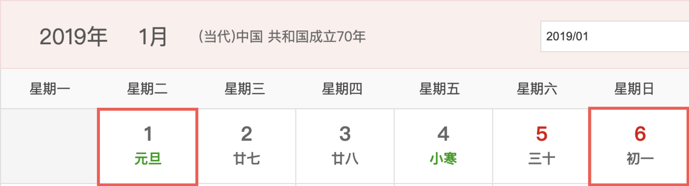
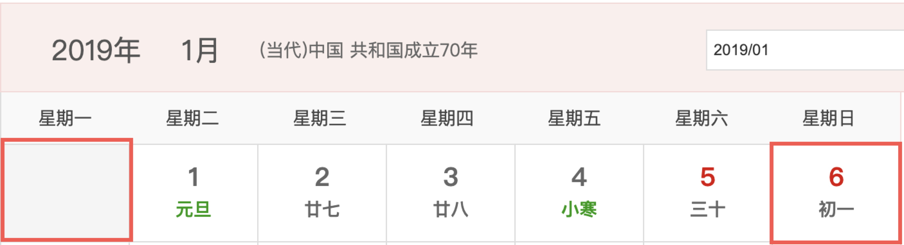

# weekjs

周日期函数，提供对周的一系列操作

-   Gzip only 1.08KB
-   100% test coverage

安装  
`yarn add weekjs` | `npm i --save weekjs`

**解析**

```js
const weekjs = require('weekjs')
let w = weekjs() // 当前时间
let w = weekjs(new Date('2019-1-1 00:00:00')) // 指定时间
let w = weekjs(1) // 当年第一周
let w = weekjs(2019, 1) // 2019年第一周
```

**获取**

```js
// 获取当前年份
weekjs(new Date('2019-1-1')).getYear() // 2019

// 获取当前周数(从1开始)
weekjs(new Date('2019-1-1')).getWeek() // 1

// 获取当年总周数
weekjs(new Date('2019-1-1')).getWeekCount() // 53
weekjs(new Date('2019-1-1')).getWeekCount(true) // 52

// 获取当年第一个周一和最后一个周日
// 返回一个Date数组
weekjs(2019, 1).getYearRange() // [ 2018-12-30T16:00:00.000Z, 2020-01-04T16:00:00.000Z ]
weekjs(2019, 1).getYearRange(true) // [ 2019-1-6T16:00:00.000Z, 2020-01-04T16:00:00.000Z ]

// 获取指定时间前一个周一
Weekjs.getPreMonday(new Date())

// 获取指定时间后一个周日
Weekjs.getPostSunDay(new Date())
```

获取范围

-   获取当前周的起止（年初和年末可能少于 7 天，其余情况返回当前周的周一和周日）
-   返回一个 Date 数组

```js
weekjs(new Date('2019-1-1')).getRange() //[ 2019-1-1, 2019-1-6 ]
```



---

```js
weekjs(new Date('2019-1-1')).getRange(true) //[ 2018-12-31, 2019-1-6 ]
```



**注意** 部分接口传参数 true 是为了符合更多业务场景，请策略使用

截图来自 https://wannianli.tianqi.com/2019/1/
